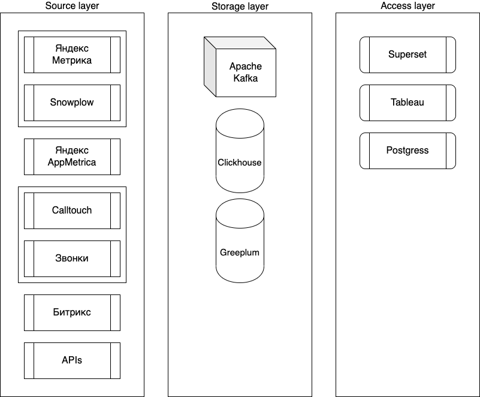

# Домашнее задание Модуля 1
## Курс [Getting Started with Analytics and Data Engineering](https://github.com/Data-Learn/data-engineering/tree/master/DE-101%20Modules/Module01#%D0%BC%D0%BE%D0%B4%D1%83%D0%BB%D1%8C-1-%D1%80%D0%BE%D0%BB%D1%8C-%D0%B0%D0%BD%D0%B0%D0%BB%D0%B8%D1%82%D0%B8%D0%BA%D0%B8-%D0%B2-%D0%BE%D1%80%D0%B3%D0%B0%D0%BD%D0%B8%D0%B7%D0%B0%D1%86%D0%B8%D0%B8)

### Архитектура Аналитического Решения

Сделал структуру сбора, хранения и визуализации маркетинговых данных, которые помогают принимать решения в отделе маркетинга. 
Компания занимается очными и онлайн-консультациями.

[СКАЧАТЬ ФАЙЛ](https://github.com/funkykesha/datalearn/blob/main/DE-101/Module1/Analytical%20Solution.drawio)

### Дашборд в экселе

Это первый опыт для меня в создании дашборда в экселе - было интересно!

[СКАЧАТЬ ФАЙЛ](https://github.com/funkykesha/datalearn/blob/main/DE-101/Module1/Sample%20-%20Superstore.xlsx)
